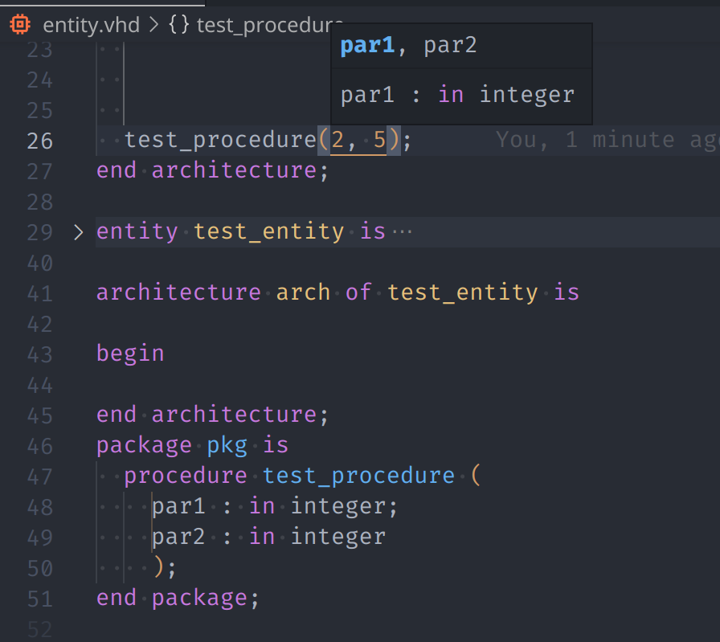
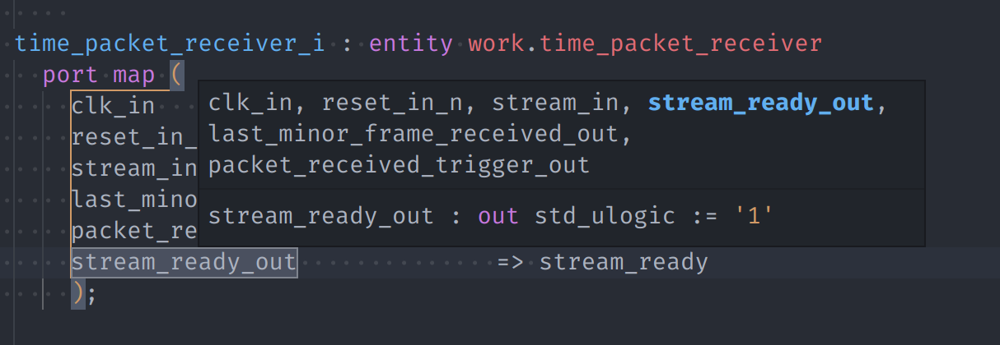
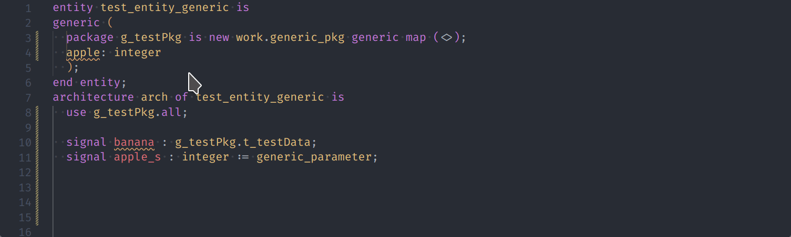
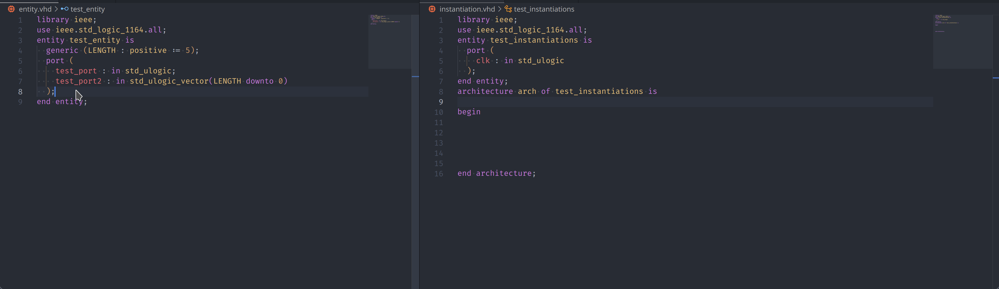

# vhdl-linter
Introducing the open-source VHDL Linter, written in TypeScript and thoroughly unit-tested for maximum reliability. Our linter is the perfect tool for checking your VHDL code for errors and ensuring that it adheres to coding standards. With its advanced analysis engine, written in TypeScript, the VHDL Linter can quickly and easily identify any issues in your code, such as syntax errors or suboptimal coding practices. Plus, our extensive unit testing ensures that the linter is reliable and accurate, so you can trust the results it provides. Try the VHDL Linter today and see the difference it can make in your design process.

(written by ChatGPT)

# Features (list is still incomplete)
## Project wide rename support
Most identifier can be renamed with the project wide rename feature.
This includes:
- ports
- signals
- package names
- entity names
- project wide definitions in packages (types, functions, etc.)

## Signature Help
Show the signature of the object being instantiated.
Currently working for instantiation of:
- entities
- procedures
- components

Signature help is not yet supported for calling of functions.

## Region Folding
Fold regions according to the file content:
- declarations
- statements
- useclauses (incl. library)
- interface lists
- special blocks like instantiations, association lists, case (generate), types (record and protected)

## Style checking
Checks custom naming styles:

## Entity Converter
Automatically convert entities to a commonly used template:
- instantiation
- component
- SystemVerilog instantiation
- ports to signals

